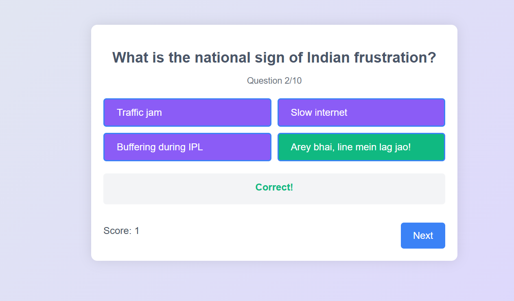

# 🎉 My Quiz Game

A fun and humorous India-themed quiz built with HTML, CSS, and JavaScript. Answer 10 quirky questions and see how much you *really* know!

## 🧠 Features

- 🎨 Clean, responsive design  
- 🎧 Background music and meme-style sound effects  
- ✅ Instant feedback on answers  
- 📊 Real-time score tracking  
- 💬 Personalized result messages  
- 🔄 Restartable gameplay  

## 🛠️ Technologies Used

- HTML5  
- CSS3 (with responsive design)  
- JavaScript (vanilla)  

## 📁 File Structure

```
├── index.html         # Main HTML layout
├── style.css          # Styling and responsiveness
├── script.js          # Game logic and interactivity
└── assets/            # Audio files (background music, meme sound effects)
```

## 🎮 How to Play

1. Click **"Start Quiz"**  
2. Choose your answer from the 4 options per question  
3. Hear funny meme sounds and get instant feedback  
4. Complete all 10 questions to see your final score and a custom message  
5. Click **"Play Again"** to restart  

> ⚠️ **Meme sounds** and **background music** are part of the experience. Make sure your sound is on!

## 📦 Setup

1. Clone or download this repository.  
2. Place your audio files (`background-music.mp3`, `correct.mp3`, `incorrect.mp3`) inside an `assets` folder.  
3. Open `index.html` in any modern browser.  

## ✨ Screenshot

  

